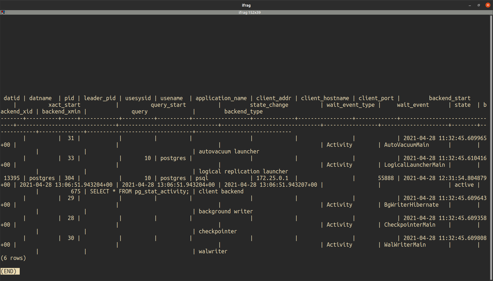

# Present db output
```sql
SELECT * FROM pg_stat_activity;
```
Знакомо?


Решение есть!
1. Скопируйте вывод
1. `python -m present_db_output -o example.json`
```json5
[
  {
    "datid": "",
    "datname": "",
    "pid": "31",
    "leader_pid": "",
    "usesysid": "",
    "usename": "",
    "application_name": "",
    "client_addr": "",
    "client_hostname": "",
    "client_port": "",
    "backend_start": "2021-04-28 11:32:45.609965+00",
    "xact_start": "",
    "query_start": "",
    "state_change": "",
    "wait_event_type": "Activity",
    "wait_event": "AutoVacuumMain",
    "state": "",
    "backend_xid": "",
    "backend_xmin": "",
    "query": "",
    "backend_type": "autovacuum launcher"
  }, // и далее
]
```
